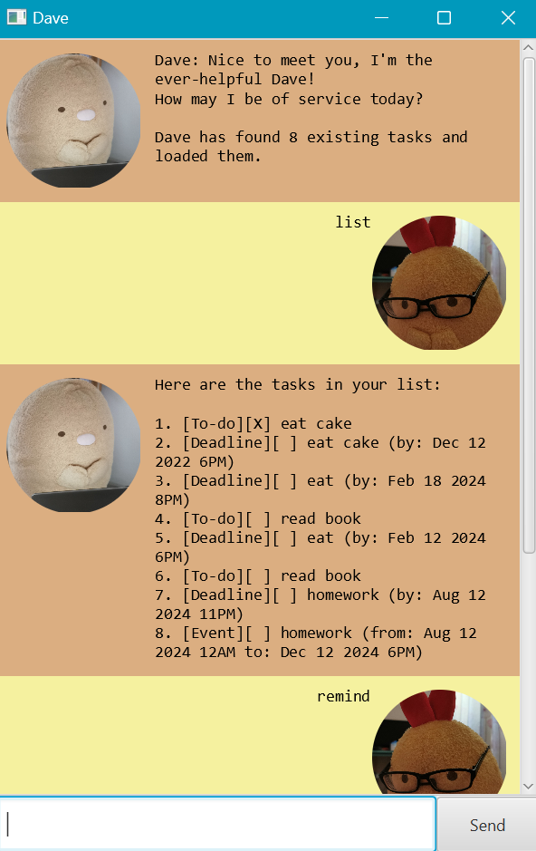

# Dave User Guide

;

## `Dave`: Your Companion For Recording Tasks :dependabot:

Dave is a chill and caring companion that helps you note down tasks you need to complete.

Dave provides the following services:
- Record **to-dos**
- Record **deadlines**
- Record **events**
- Mark/unmark tasks
- Delete tasks
- Save your task list
- Search for tasks
- Show task list
- Show reminders for upcoming tasks due in a week
> Note: Users need to enter the appropriate commands in a valid format to command Dave.

To start operating your own Dave,

1. Download the latest release [here](https://github.com/iynixil/ip/releases).
2. Execute the "Dave.jar" file either by double-clicking it, or using the command "java -jar Dave.jar" in your preferred terminal.
> [!NOTE]
> Either way of execution requires the user to be in the folder that Dave.jar was downloaded in.
3. Execute commands. (simply press "Enter" as your first input to Dave to see all available commands)
4. You're all set! Now you have your very own Dave to command.

## Recording to-dos

Records a single to-do task.

Input: `todo <task name>`

Examples: `todo eat cake`, `todo read book`, `todo homework`

When the command succeeds, Dave will let you know by saying that it has been added.
Otherwise, Dave will let you know why the command failed.

On successful command:
```
Dave added the task:
  [To-do][ ] read book
You now have 1 task(s).
```

## Recording deadlines

Records a single deadline task.

Input: `deadline <task name> /by dd/mm/yyyy hhmm`

Examples: `deadline eat cake /by 12/12/2024 1800`, `deadline read book /by 08/08/2024 1900`, `deadline homework /by 12/08/2024 2359`

When the command succeeds, Dave will let you know by saying that it has been added.
Otherwise, Dave will let you know why the command failed.

On successful command:
```
Dave added the task:
  [Deadline][ ] homework (by: Aug 12 2024 11PM)
You now have 1 task(s).
```

## Recording events

Records a single event task.

Input: `event <task name> /from dd/mm/yyyy hhmm /to dd/mm/yyyy hhmm`

Examples: `event eat cake /from 12/12/2024 1800 /to 12/12/2024 2000`, `event read book /from 08/08/2024 1900 /to 12/12/2024 1945`, `event homework /from 12/08/2024 0000 /to 12/12/2024 1800`

When the command succeeds, Dave will let you know by saying that it has been added.
Otherwise, Dave will let you know why the command failed.

On successful command:
```
Dave added the task:
  [Event][ ] homework (from: Aug 12 2024 12AM to: Dec 12 2024 6PM)
You now have 1 task(s).
```

### Mark/unmark tasks

Marks or unmarks a single task.

Input: `mark <task number>` / `unmark <task number>`
> [!IMPORTANT]
> The task number given is based on how tasks are ordered in the "list" command.

Examples: `mark 1`, `unmark 1`

When the command succeeds, Dave will let you know by saying that the task has been marked.
Otherwise, Dave will let you know why the command failed.

On successful command for "mark":
```
Good job! Dave will mark this task as done
  [To-do][X] read book
```

On successful command for "unmark":
```
Alright, Dave believes you'll get this done eventually:
  [To-do][ ] read book
```

### Delete tasks

Deletes a single task.

Input: `delete <task number>`
> [!IMPORTANT]
> The task number given is based on how tasks are ordered in the "list" command.

Examples: `delete 1`, `delete 2`

When the command succeeds, Dave will let you know by saying that the task has been marked.
Otherwise, Dave will let you know why the command failed.

On successful command:
```
Dave removed the task:
  [To-do][ ] read book
You now have 1 task(s).
```

### Save your task list.

Saves the task list whenever it is modified.
This is an automatic action by Dave and is not a command.

Saved tasks will appear in the "data" folder that Dave.jar is located in, under "data/tasks.txt".

### Search for tasks

Searches for task names that contain the keyword given.

Input: `find <keyword>`

Examples: `find r`, `find e`

When the command succeeds, Dave will show the tasks containing the keyword.
Otherwise, Dave will let you know why the command failed.

On successful command:
```
Dave has found the following matching tasks:
1.  [To-do][ ] read book
You now have 1 task(s).
```

### Show task list

Lists all tasks.

Input: `list`

When the command succeeds, Dave will show all tasks and their information.
Otherwise, Dave will let you know why the command failed.

On successful command:
```
Here are the tasks in your list:
1.  [To-do][ ] read book
```

### Show reminders for upcoming tasks due in a week

Shows deadline or event tasks that are due in a week but not yet done.
It also shows to-do tasks and expired tasks if they are not yet done.

Input: `remind`

When the command succeeds, Dave will show all deadline, event, to-dos and expired tasks not yet done.
Otherwise, Dave will let you know why the command failed.

On successful command:
```
These are the tasks due within a week
(Feb 18 2024 7PM - Feb 25 2024 7PM):
    - [Deadline][ ] eat (by: Feb 18 2024 8PM)

You still have the following TODO/expired tasks not done yet:
    - [Deadline][ ] eat cake (by: Dec 12 2022 6PM)
    - [To-do][ ] read book
    - [Deadline][ ] eat (by: Feb 12 2024 6PM)
    - [To-do][ ] read book
    - [Deadline][ ] homework (by: Aug 12 2024 11PM)
    - [Event][ ] homework (from: Aug 12 2024 12AM to: Dec 12 2024 6PM)
```